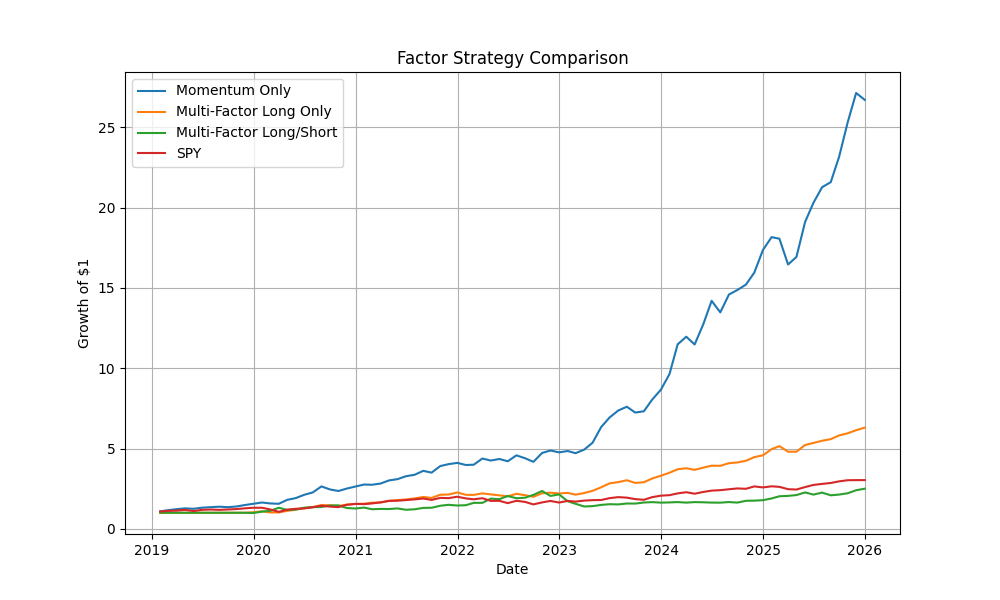

# Systematic Factor Strategy Backtest

## Overview
This project builds a systematic equity strategy using momentum and volatility factors. It evaluates both long-only and long/short portfolio constructions and compares performance against the S&P 500 (SPY).

## Strategy Framework

### Momentum Strategy (Long Only)
- Ranks stocks based on 12-month momentum
- Selects top-performing stocks each month
- Equal-weight portfolio with monthly rebalancing

### Multi-Factor Strategy
- Combines momentum and volatility factors
- Prefers stocks with strong returns and lower risk
- Improves risk-adjusted performance

### Long/Short Strategy
- Long top-ranked stocks and short bottom-ranked stocks
- Reduces market exposure
- Targets relative performance (alpha)

## Data
- Source: yfinance
- Universe: Large-cap U.S. equities
- Benchmark: SPY
- Frequency: Monthly

## Strategy Performance

## Key Insights
- Momentum generated strong returns but with concentration risk
- Multi-factor approach improved stability and Sharpe ratio
- Long/short reduced market beta but introduced short-side limitations

## Limitations
- No transaction costs or slippage
- Simplified universe selection
- Potential survivorship bias

## Technologies Used
- Python
- pandas
- numpy
- matplotlib
- yfinance
